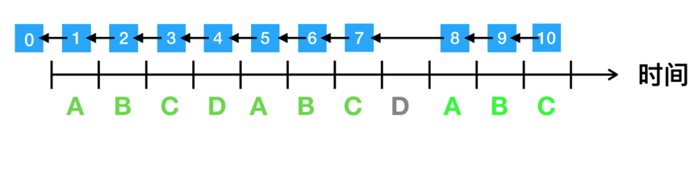

## 共识机制
Hubble Network 的共识机制采用一种全新的 Vortex 共识算法，称为 Vortex 共识机制;并融入了保证金、高安全、终局性、激励机制等设计。Vortex 的主要技术特征如下:
1. 交易吞吐量高: Vortex 共识算法加速交易打包和区块生成，获得了较高的VNT Chain 分布式智能价值网络的交易吞吐量;
2. 具备终局性: 任何交易经过一段时间之后，总能被区块链最终确认，并且无法进行回滚;
3. 安全性高: Vortex 能够应对各种包含 Nothing at stack、Long range attack、Double spending attack 与 Bribery attack 等攻击，有效防止产生分叉;
4. 传输效率高: Vortex 实现了在各个节点与验证节点间快速传递交易信息，有效降低各个节点之间的网络流量;
5. 有效的激励机制: Vortex 提供了一种奖励机制，对区块链网络中的交易打包节点、交易传输节点、监督节点进行奖励，形成高效的传输通路和快速处理交易，对揭露节点恶意行为进行奖励。
   
## 共识流程
- 每个周期只有1个见证人能够产生区块。
- 第1个周期产生区块的见证人是见证人列表的第1个见证人。
- 见证人在它的周期内只能产生1个区块，并且产生区块的时间戳是周期末尾。比如周期为2，则在2，4，6，8这些时间点上产生区块。
- 见证人列表长度是不变的，不支持增加和减少见证人。
- 每个周期的见证人通过轮询的方式选择。比如，第2个周期的见证人就是列表的第2个，一直轮询下去，直到最后一个见证人，然后下一个周期的的见证人，又是第1个见证人，然后再轮询下去。
- 如果见证人在他的周期而没有出块，则它不能再事后补该周期的区块。它的区块会被其他节点拒绝。
