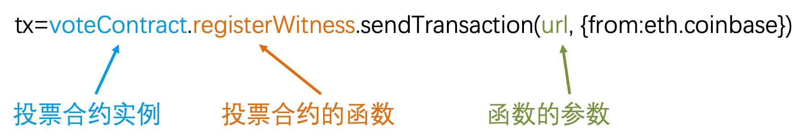

# 投票合约使用教程

本文介绍投票合约在gvnt console的使用方法，投票合约的使用方式和普通的合约是一致的。如果了解普通合约的使用，很快就可以掌握投票合约的使用，下面主要介绍投票合约的使用，会捎带介绍合约的基本使用。

### 基本介绍

投票合约的作用是选出见证人。投票合约提供了以下9个功能：

1. 投票人抵押stake、取消抵押
2. 注册候选人、取消注册
3. 投票人为候选人投票、取消投票
4. 投票人设置代理人、取消代理，投票人开启代理、关闭代理
5. 见证人提取投票激励

以上每个功能对应了投票合约的1个函数，具体将在下面介绍。

### 投票合约基本信息

#### 投票合约地址

`0x0000000000000000000000000000000000000009`

#### 投票合约ABI

ABI描述了合约的每个函数的入参和输出结果。

```js
[{
    "inputs": [{
        "name": "url",
        "type": "bytes"
    }],
    "name": "registerWitness",
    "outputs": [],
    "type": "function"
}, {
    "inputs": [],
    "name": "unregisterWitness",
    "outputs": [],
    "type": "function"
}, {
    "inputs": [{
        "name": "candidate",
        "type": "address[]"
    }],
    "name": "voteWitnesses",
    "outputs": [],
    "type": "function"
}, {
    "inputs": [],
    "name": "cancelVote",
    "outputs": [],
    "type": "function"
}, {
    "inputs": [],
    "name": "startProxy",
    "outputs": [],
    "type": "function"
}, {
    "inputs": [],
    "name": "stopProxy",
    "outputs": [],
    "type": "function"
}, {
    "inputs": [],
    "name": "cancelProxy",
    "outputs": [],
    "type": "function"
}, {
    "inputs": [{
        "name": "proxy",
        "type": "address"
    }],
    "name": "setProxy",
    "outputs": [],
    "type": "function"
}, {
    "inputs": [{
        "name": "stakeCount",
        "type": "uint256"
    }],
    "name": "stake",
    "outputs": [],
    "type": "function"
}, {
    "inputs": [],
    "name": "unStake",
    "outputs": [],
    "type": "function"
}, {
    "inputs": [],
    "name": "extractOwnBounty",
    "outputs": [],
    "type": "function"
}]
```

### 投票合约的使用

在console使用ABI获取投票合约实例：

```js
var abi =[{"inputs":[{"name":"url","type":"bytes"}],"name":"registerWitness","outputs":[],"type":"function"},{"inputs":[],"name":"unregisterWitness","outputs":[],"type":"function"},{"inputs":[{"name":"candidate","type":"address[]"}],"name":"voteWitnesses","outputs":[],"type":"function"},{"inputs":[],"name":"cancelVote","outputs":[],"type":"function"},{"inputs":[],"name":"startProxy","outputs":[],"type":"function"},{"inputs":[],"name":"stopProxy","outputs":[],"type":"function"},{"inputs":[],"name":"cancelProxy","outputs":[],"type":"function"},{"inputs":[{"name":"proxy","type":"address"}],"name":"setProxy","outputs":[],"type":"function"},{"inputs":[{"name":"stakeCount","type":"uint256"}],"name":"stake","outputs":[],"type":"function"},{"inputs":[],"name":"unStake","outputs":[],"type":"function"},{"inputs":[],"name":"extractOwnBounty","outputs":[],"type":"function"}]
var voteContract = web3.core.contract(abi).at("0x0000000000000000000000000000000000000009");
```

#### 合约的调用方法



#### 注册见证人节点

从ABI可以看出来，当前注册见证人只需要提供1个参数：url，即见证人节点的p2p地址。

```js
tx=voteContract.registerWitness.sendTransaction(url, {from:core.coinbase})
```

#### 取消注册见证人节点

取消注册见证人无入参。

```js
tx=voteContract.unregisterWitness.sendTransaction({from:core.coinbase})
```

#### 投票人抵押代币

投票人在投票前需要抵押代币，参数只有1个，即本次抵押代币的数量，代币单位为VNT。

```js
tx=voteContract.stake.sendTransaction(5, {from:core.coinbase})
```

#### 投票人取消抵押代币

投票人赎回抵押的代币。

```js
tx=voteContract.unStake.sendTransaction({from:core.coinbase})
```

#### 投票人投票

投票见证人只有1个参数：候选人账号地址的列表。示例是把票投给了自己。

```js
tx=voteContract.voteWitnesses.sendTransaction([core.coinbase], {from:core.coinbase})
```

#### 投票人取消投票

投票人取消对见证人的投票。

```js
tx=voteContract.cancelVote.sendTransaction({from:core.coinbase})
```

#### 见证人提取投票激励

提取激励时不需要提供参数。

```js
tx=voteContract.extractOwnBounty.sendTransaction({from:core.coinbase})
```

#### 开启代理

开启代理成为代理人，代表节点愿意替代别人投票。

```js
tx=voteContract.startProxy.sendTransaction({from:core.coinbase})
```

#### 关闭代理

关闭代理不再当代理人，代表不再代表其他人投票。

```js
tx=voteContract.stopProxy.sendTransaction({from:core.coinbase})
```

#### 设置代理

让代理节点替代自己投票，示例让`0x2c6822e1529e5bb080b1d0290ec035e77c0a7260`替代本账号投票。

```js
tx=voteContract.setProxy.sendTransaction("0x2c6822e1529e5bb080b1d0290ec035e77c0a7260"，{from:core.coinbase})
```

#### 取消代理

取消之前设置的代理，不让代理节点替代本节点投票。

```js
tx=voteContract.cancelProxy.sendTransaction({from:core.coinbase})
```

### 查询投票信息

当前提供了3个JSON RPC API可以查询投票合约信息，具体信息见[JSON RPC API文档](../../api/vnt-json-rpc-api.md)。

- `core_getVoter`：获取某个投票人的所有信息。
- `core_getAllCandidates`：获取所有见证人候选人的信息。
- `core_getRestVNTBounty`：获取当前VNT激励剩余值。


